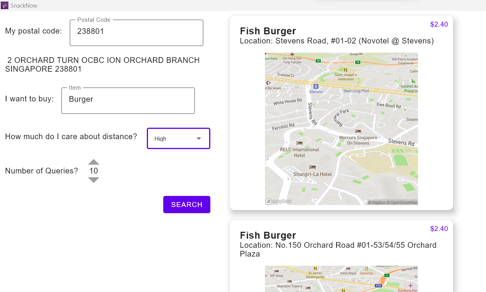

# SnackNow
> CS5132 PA2: Using Spatial R-Trees to optimize Food Costs for Lower Wage Families
>
> Done by Kannan Vishal, Prannaya Gupta, Quek Yu Pin and Vikram Ramanathan

SnackNow is an application rendered with Jetpack Compose that enables users to search for the cheapest items near them. The user is allowed to select three distance options, `"High"`, `"Medium"`, and `"Low"`, describing the weighting given to distance. For instance, selecting `"High"` will return only results that are close to the user, whereas selecting `"Low"` will allow for results from a much larger swathe of Singapore. Do note that the app only works _within_ the confines of Singapore.

In order to use the application, simply enter your postal code, the name of the item you want to search for (such as `"Chicken"`), the distance priority, and the maximum number of results to be returned. Then, press `SEARCH`, and the app will do the rest of the work for you.

The Postal Code is required to find one's location. We do not record or store your personal data. Please do not be alarmed.

This app has also be equipped with a relevant outputted file which can be run on most systems.

## Layout of App

