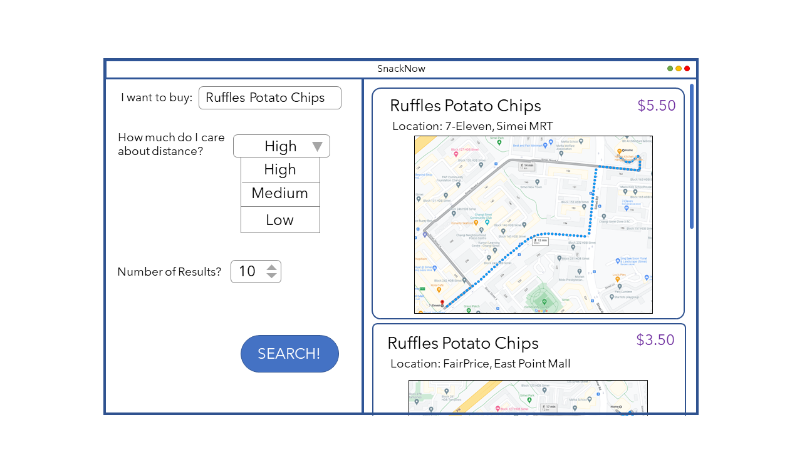

# SnackNow
> CS5132 PA2: Using Spatial R-Trees to optimize Food Costs for Lower Wage Families
>
> Done by Kannan Vishal, Prannaya Gupta, Quek Yu Pin and Vikram Ramanathan

## Work Distribution

|Task|Name(s) of Contributors|
|---|---|
|Spatial R-Tree Implementation|Vikram|
|User Interface|Prannaya|
|Data Collection|Yu Pin|

## Proposed Layout of App

